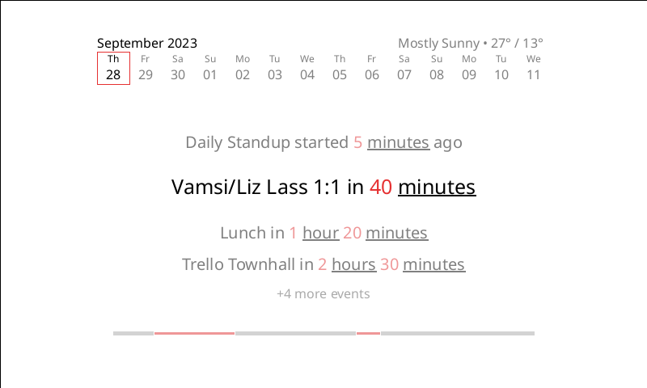

# E-Ink Calendar
The purpose of this device is to show daily meetings on an e-ink display. Credit to [Vamc19](https://github.com/vamc19) for idea, hardware, and UI design.

### Hardware
* [7.5inch E-Paper (B) E-Ink Raw Display, 800×480](https://www.waveshare.com/7.5inch-e-paper-b.htm)
* [Universal e-Paper Raw Panel Driver HAT](https://www.waveshare.com/7.5inch-e-paper-hat-b.htm)

### RPC-optional System
We take the term "Remote Procedure Call" very literally. Every render call is saved into memory, serialized to bytes, and played back in client.

There are 2 ways to drive this thing. The first is to just do all the image layout, network requests, and processing on the client. The API in this repo can absolutely do that. The problem with this approach is that it would take better hardware than what I have on-hand. You're asking more of the client, which affects longevity and battery life.

The second way is by having an RPC system where the backend does all the heavy lifting (layout, network requests, and formatting), and the client is just a simple renderer. This approach is frequently called "Backend for Frontend", and is kinda how YouTube's infra operates to support multiple clients.

